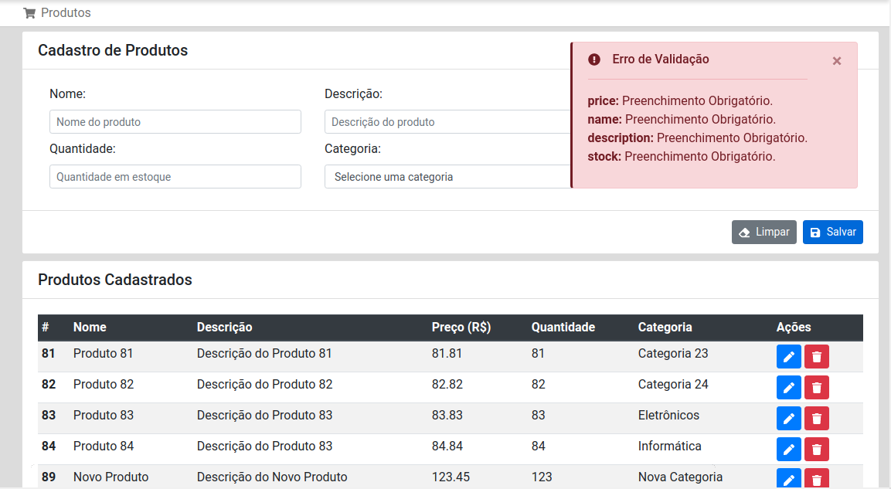

# Simple-CRUD-Java-Spring-React  
This project consists in a basic CRUD application using Java with Spring Boot on the backend and JavaScript with React JS on the frontend. This is part of a personal portfolio of full-stack web development projects.
The project has just two entities: Product and Category. There is a one-to-many relatioship between this two entities, where a product belongs to only one category and a category can have multiple products. 

## Features
- Complete CRUD of products and categories
- Paginated list of both entities.
- Validation of data entry on the server with success/error alerts on the frontend
- Single Page Application on the frontend

> **Note:** User authentication has not been implemented.

## Application Screenshots

### Products page


### Categories page


### Pagination detail


### Update product detail


### Delete product detail


### Alert success detail


### Alert error detail


## Download the Application
You can clone this repository with HTTPS using the command below. You'll get two folders: *"./simple-crud-api"* and *"./simple-crud-frontend"*, containing the backend and the frontend projects respectively.
```bash
git clone https://github.com/devtiagom/simple-crud-java-spring-react
```

## 1 - Backend
The backend is a rest API constructed with Java language using Spring Framework. The API uses Spring Data JPA, Hibernate Validator, Project Lombok to reduce boilerplate code, PostgreSQL as database and Gradle as build tool.

###  1.1 - To build and run the server application

#### 1.1.1 - Database
First of all you need to run a sql database instance. I used the Postgres database, but it can be easily changed including the appropriate dependency in the *"build.gradle"* file. Anyway, you should review the database url and credentials in the *"application.properties"* file.

#### 1.1.2 - Build the Spring Boot Java project
In the Spring Boot project root folder:
```bash
./gradlew clean build
```

#### 1.1.3 - Run the Spring Boot Java project
From Spring Boot project root folder, change to build/libs folder and run the *.jar* file:
```bash
cd build/libs &&
java -jar simple-crud-api-0.0.1-SNAPSHOT.jar
```
>**Note:** The server should run at http://localhost:8080 by default.

## 2 - Frontend
The frontend is a single page application constructed with JavaScript language using React JS library. The SPA uses React Hooks *useState* and *useEffect* to manage components local state and components lifecycle, was not used Redux library. Also, the interface styles was constructed using Bootstrap CSS. The application routes were managed with the  *react-router-dom* library. And, to communicate with server API, was used the Axios library. The application has been launched using *create-react-app*, and uses *yarn* as package manager.

### 2.1 - To build and run the frontend application
Just run the command below in the React project root folder:
```bash
yarn start
```
>**Note:** The application should run at http://localhost:3000 by default.